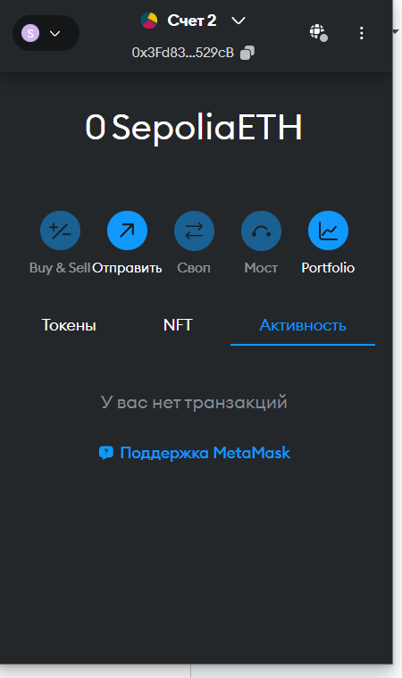
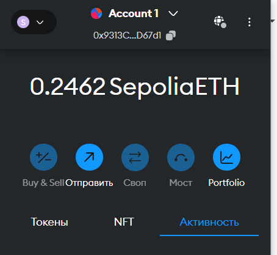
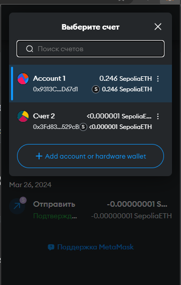
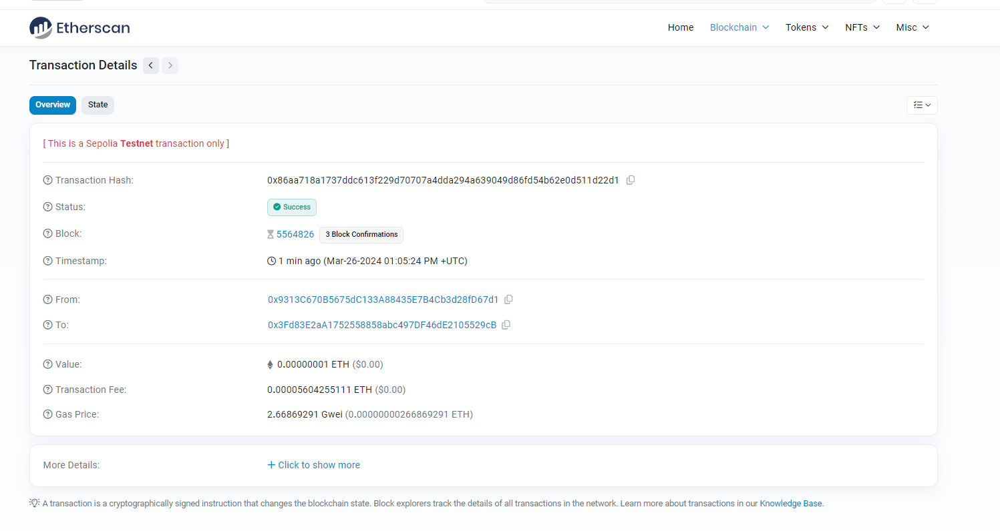
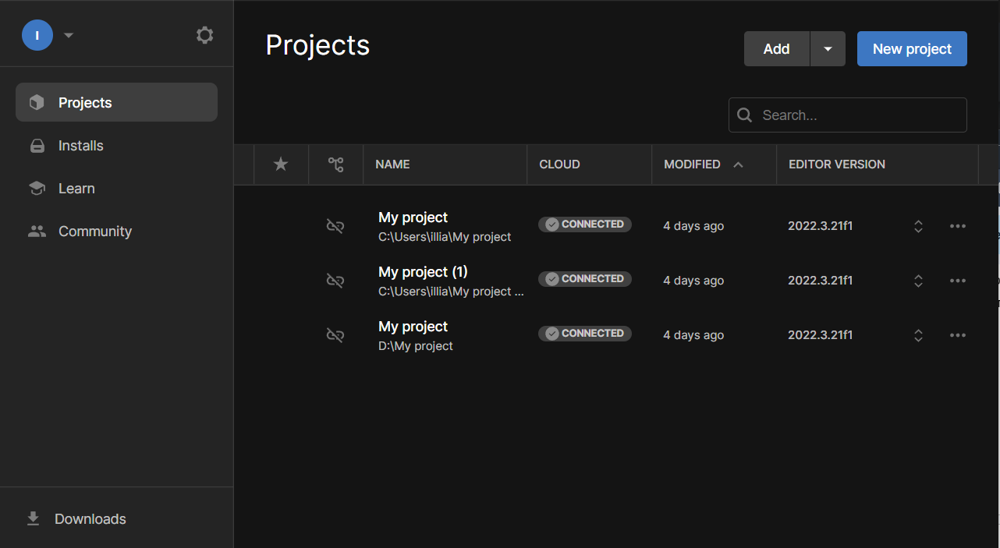
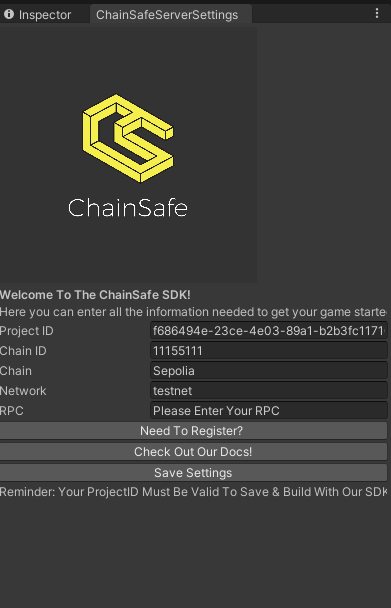

# pract 01

__Налаштування оточення для подальшої розробки Налаштування Metamask__
 
1. **Встановлення гаманця Metamask**

2. **Отримання тестових монет:**

3. **Відправленно частину коштів на інший гаманець**

4. **Поля транзакції:**

5. **Встановлення та налаштування середовища Unity:**

6. **Встановленно та налаштованно ChainSafe та Metamask**

