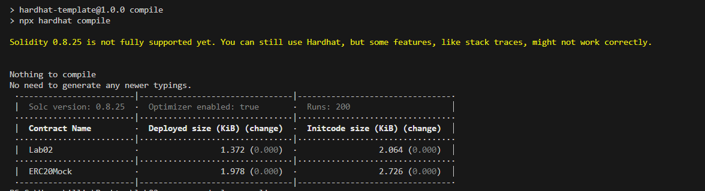

# pract 01

__Базові знання про смартконтракти. Solidity, деплой, тестування__
 
1. **Створено репозиторії за допомогою наданого шаблону**


2. **Створенно простий смартконтракт:**

```js
// SPDX-License-Identifier: MIT
pragma solidity ^0.8.25;

contract Lab02 {
    // Змінні різних типів
    address public owner;
    uint256 public amount;
    string public description;

    // Конструктор контракту
    constructor(address _owner, uint256 _amount, string memory _description) {
        owner = _owner;
        amount = _amount;
        description = _description;
    }
    
    // Функція для зміни опису
    function changeDescription(string memory _newDescription) public {
        description = _newDescription;
    }

    // Функція для встановлення нового власника
    function setOwner(address _newOwner) public {
        owner = _newOwner;
    }

    // Функція для встановлення нової суми
    function setAmount(uint256 _newAmount) public {
        amount = _newAmount;
    }

    // Функція для отримання поточного значення власника
    function getOwner() public view returns (address) {
        return owner;
    }

    // Функція для отримання поточного значення суми
    function getAmount() public view returns (uint256) {
        return amount;
    }

    // Функція для отримання поточного значення опису
    function getDescription() public view returns (string memory) {
        return description;
    }
}

```

3. **Виведеня поточних результатів:**


4. **Виведенно оновлені данних**


5. **Ті ж самі кроки через hardhat**




