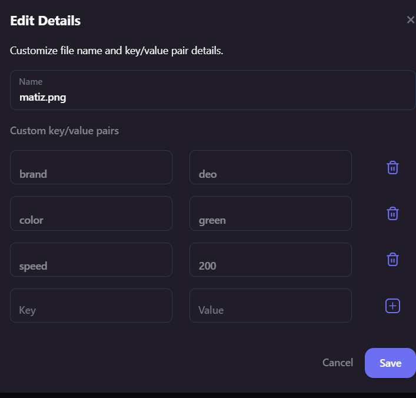

# lab 03 

__Основні стандарти токенів. ERC20, ERC721 та ERC1155__

1. **Створено контракт ERC20 та запушив його у мережу **


```js
// SPDX-License-Identifier: MIT
// Compatible with OpenZeppelin Contracts ^5.0.0
pragma solidity ^0.8.20;

import "@openzeppelin/contracts/token/ERC20/ERC20.sol";
import "@openzeppelin/contracts/access/Ownable.sol";

contract DriftCoin is ERC20, Ownable {
    constructor(address initialOwner)
        ERC20("DriftCoin", "DRC")
        Ownable(initialOwner)
    {}
}
```

https://sepolia.etherscan.io/address/0x19c4334e471b78df8734e6a977e1a1f367d43ada

2. **Створенно ERC721**

```js
// SPDX-License-Identifier: MIT
// Compatible with OpenZeppelin Contracts ^5.0.0

pragma solidity ^0.8.20;

import "@openzeppelin/contracts/token/ERC721/extensions/ERC721URIStorage.sol";
import "@openzeppelin/contracts/access/Ownable.sol";
import "./ERC20Token.sol";

contract DriftItem is ERC721URIStorage, Ownable {
    string private baseTokenURI;
    uint256 private price;
    address private tokenContract;

    constructor(address initialOwner, string memory _baseTokenURI) Ownable(initialOwner) ERC721("DriftItem", "DRIFTITEM") {
        baseTokenURI = _baseTokenURI;
    }

    function setTokenContract(address _tokenContract) external onlyOwner {
        tokenContract = _tokenContract;
    }

    function setPrice(uint256 _price) external onlyOwner {
        price = _price;
    }

    function buyNFT(uint256 _tokenId) external {
        require(msg.sender != address(0), "Invalid address");
        require(tokenContract != address(0), "Token contract address not set");
        require(price > 0, "Price not set");

        // Transfer tokens from the buyer to the owner of the NFT
        require(DriftCoin(tokenContract).transferFrom(msg.sender, owner(), price), "Transfer failed");

        // Transfer ownership of the NFT
        _transfer(ownerOf(_tokenId), msg.sender, _tokenId);
    }

    function tokenURI(uint256) public view override returns (string memory) {
        return baseTokenURI;
    }

    function setBaseTokenURI(string memory _baseTokenURI) external onlyOwner {
        baseTokenURI = _baseTokenURI;
    }
}

```

https://sepolia.etherscan.io/tx/0x3a8c132112a1c003518e7c4e1b8b4b544c3711e8472751819e602e4bc3b30475

3. **Створив та закинув у ipfs**


https://amber-high-spoonbill-845.mypinata.cloud/ipfs/QmY3Rytfa7p37b7HE1DWw8wimbRXhaVKrtGcTVNn7P5kKB


