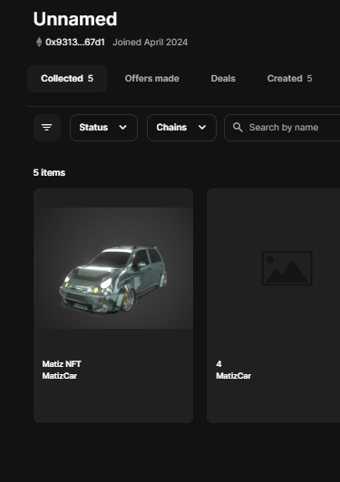

# lab 03 

__Основні стандарти токенів. ERC20, ERC721 та ERC1155__

1. **Створено контракт ERC20 та задеплоіл його у мережу **


```js
// SPDX-License-Identifier: MIT
pragma solidity ^0.8.20;

import "@openzeppelin/contracts/token/ERC20/ERC20.sol";
import "@openzeppelin/contracts/token/ERC20/extensions/ERC20Permit.sol";
import "@openzeppelin/contracts/access/Ownable.sol";

contract DriftCoin is ERC20, ERC20Permit, Ownable {
    constructor(address initialOwner)
        ERC20("DriftCoin", "DM")
        ERC20Permit("DriftCoin")
        Ownable(initialOwner)
    {}

    function mint(address to, uint256 amount) external onlyOwner {
        _mint(to, amount);
    }
}

```

https://sepolia.etherscan.io/address/0x19c4334e471b78df8734e6a977e1a1f367d43ada

2. **Створенно ERC721**

```js
// SPDX-License-Identifier: MIT
// Compatible with OpenZeppelin Contracts ^5.0.0

// SPDX-License-Identifier: MIT
pragma solidity ^0.8.20;

import "@openzeppelin/contracts/token/ERC721/ERC721.sol";
import "@openzeppelin/contracts/access/Ownable.sol";
import "@openzeppelin/contracts/utils/Counters.sol";
import "@openzeppelin/contracts/token/ERC20/IERC20.sol";

contract MatizCarNFT is ERC721, Ownable {
    using Counters for Counters.Counter;
    Counters.Counter private _tokenIds;

    address public tokenAddress; 
    string public baseURI; 

    mapping(uint256 => uint256) public tokenPrices; 

    constructor(address _tokenAddress, string memory _baseURI, address _initialOwner) ERC721("MatizCar", "MTZC") Ownable(_initialOwner) {
        tokenAddress = _tokenAddress;
        baseURI = _baseURI;
    }

    function tokenURI(uint256 _tokenId) public view override returns (string memory) {
        require(_tokenId <= _tokenIds.current(), "ERC721Metadata: URI query for nonexistent token");
        return baseURI;
    }

    function setBaseURI(string memory _newBaseURI) external onlyOwner {
        baseURI = _newBaseURI;
    }

    function mintNFT(uint256 price) external onlyOwner returns (uint256) {
        address recipient = owner();
        _tokenIds.increment();
        uint256 newNFTId = _tokenIds.current();
        _mint(recipient, newNFTId);
        tokenPrices[newNFTId] = price;
        return newNFTId;
    }

    function buyNFT(uint256 tokenId) external {
        require(tokenPrices[tokenId] > 0, "This NFT is not for sale.");
        uint256 price = tokenPrices[tokenId];
        require(IERC20(tokenAddress).transferFrom(msg.sender, owner(), price), "Token transfer failed.");
        _transfer(ownerOf(tokenId), msg.sender, tokenId);
        delete tokenPrices[tokenId];
    }
}


```

https://sepolia.etherscan.io/address/0x3d2ffafd037173e47a920fe66410c9d3e68b7e89

3. **Створив та закинув у ipfs**


https://amber-high-spoonbill-845.mypinata.cloud/ipfs/QmY3Rytfa7p37b7HE1DWw8wimbRXhaVKrtGcTVNn7P5kKB


4. Демонстрація роботи nft




https://testnets.opensea.io/assets/sepolia/0x3d2ffafd037173e47a920fe66410c9d3e68b7e89/1