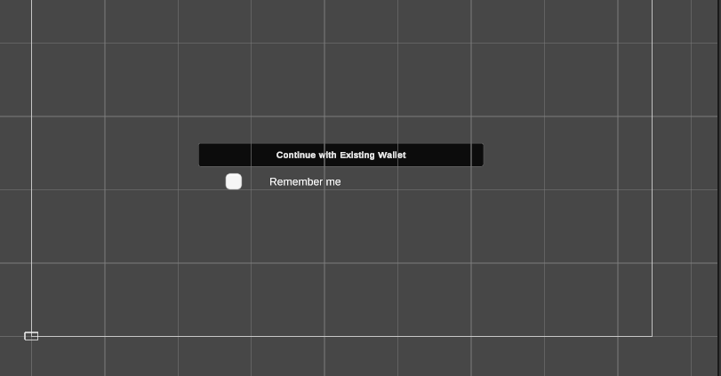
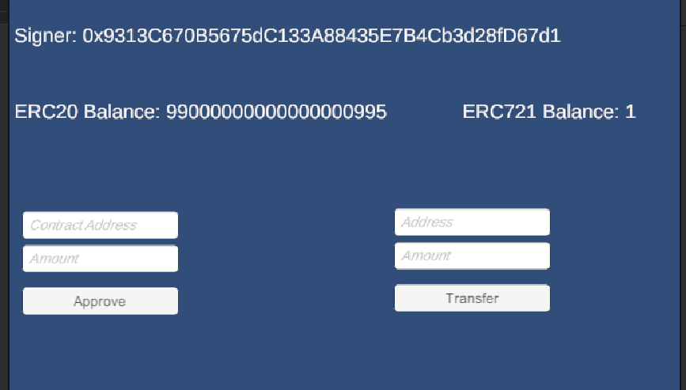

# lab 04

__ChainSafe SDK для Unity. Виклики функцій стандартних токенів__

1. *Створенно логін через MetaMask*



2. *Створено сцену з виводом адрессу користовача, балансу токенів*



3. *Після введеня данних у праву колону, було передано 1 токен на іншу адрессу*

https://sepolia.etherscan.io/tx/0xd6f2d7912ed51974405e57996ee319830d551f6d961226ce3fc7e1e33f324c16

3. *Після введеня данних у другу, було зроблено апрув адресси*

https://sepolia.etherscan.io/tx/0xc713915214bfb2d9c1398db6189be9a04a7aff4e31f58993bee9e24232976697

Скріпт логіки

```js
using UnityEngine;
using TMPro;
using ChainSafe.Gaming.Web3;
using System.Numerics;
using System.Threading.Tasks;
using ChainSafe.Gaming.UnityPackage;
using UnityEngine.UI;
using Scripts.EVM.Token;

public class MainManager : MonoBehaviour
{
    [SerializeField] private string ERC20TokenAddr;
    [SerializeField] private string ERC721TokenAddr;
    [SerializeField] private TMP_Text SignerAddressText;
    [SerializeField] private TMP_Text ERC20BalanceText;
    [SerializeField] private TMP_Text ERC721BalanceText;
    [SerializeField] private TMP_InputField TransferRecipientInput;
    [SerializeField] private TMP_InputField TransferAmountInput;
    [SerializeField] private TMP_InputField SpenderAddressInput;
    [SerializeField] private TMP_InputField ApprovalAmountInput;
    [SerializeField] private Button TransferButton;
    [SerializeField] private Button ApproveButton;

    private string signerAddress;

    private async void Start()
    {
        Web3 web3 = Web3Accessor.Web3;

        signerAddress = await web3.Signer.GetAddress();
        SignerAddressText.text = "Signer: " + signerAddress;

        // Отримання та відображення балансу користувача ERC20 та ERC721 токенів
        BigInteger erc20Balance = await Erc20.BalanceOf(web3, ERC20TokenAddr, signerAddress);
        BigInteger erc721Balance = await Erc721.BalanceOf(web3, ERC721TokenAddr, signerAddress);

        ERC20BalanceText.text = "ERC20 Balance: " + erc20Balance.ToString();
        ERC721BalanceText.text = "ERC721 Balance: " + erc721Balance.ToString();
    
        // Налаштування обробника кнопок для виконання трансферу та approve
        TransferButton.onClick.AddListener(TransferTokens);
        ApproveButton.onClick.AddListener(ApproveTokens);
    }

    // Функція для виконання трансферу ERC20 токенів
    private async void TransferTokens()
    {
        string recipientAddress = TransferRecipientInput.text;
        BigInteger transferAmount = BigInteger.Parse(TransferAmountInput.text);

        // Виклик функції трансферу ERC20
        await TransferErc20(ERC20TokenAddr, recipientAddress, transferAmount);

        // Оновлення балансу після трансферу
        BigInteger erc20Balance = await Erc20.BalanceOf(Web3Accessor.Web3, ERC20TokenAddr, signerAddress);
        ERC20BalanceText.text = "ERC20 Balance: " + erc20Balance.ToString();
    }

    // Функція для виклику методу approve ERC20
    private async void ApproveTokens()
    {
        string spenderAddress = SpenderAddressInput.text;
        BigInteger approvalAmount = BigInteger.Parse(ApprovalAmountInput.text);

        // Виклик функції approve ERC20
        await ApproveErc20(ERC20TokenAddr, spenderAddress, approvalAmount);
    }

    // Функція для виклику методу трансферу ERC20
    private async Task TransferErc20(string contractAddress, string recipientAddress, BigInteger amount)
    {
        Web3 web3 = Web3Accessor.Web3;
        string abi = "[{\"inputs\":[{\"internalType\":\"address\",\"name\":\"recipient\",\"type\":\"address\"},{\"internalType\":\"uint256\",\"name\":\"amount\",\"type\":\"uint256\"}],\"name\":\"transfer\",\"outputs\":[{\"internalType\":\"bool\",\"name\":\"\",\"type\":\"bool\"}],\"stateMutability\":\"nonpayable\",\"type\":\"function\"}]";
        string method = "transfer";

        await web3.ContractBuilder.Build(abi, contractAddress).Send(method, new object[] { recipientAddress, amount });
    }

    // Функція для виклику методу approve ERC20
    private async Task ApproveErc20(string contractAddress, string spenderAddress, BigInteger approvalAmount)
    {
        Web3 web3 = Web3Accessor.Web3;
        string abi = "[{\"inputs\":[{\"internalType\":\"address\",\"name\":\"spender\",\"type\":\"address\"},{\"internalType\":\"uint256\",\"name\":\"amount\",\"type\":\"uint256\"}],\"name\":\"approve\",\"outputs\":[{\"internalType\":\"bool\",\"name\":\"\",\"type\":\"bool\"}],\"stateMutability\":\"nonpayable\",\"type\":\"function\"}]";
        string method = "approve";

        await web3.ContractBuilder.Build(abi, contractAddress).Send(method, new object[] { spenderAddress, approvalAmount });
    }
}

```