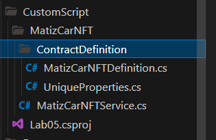
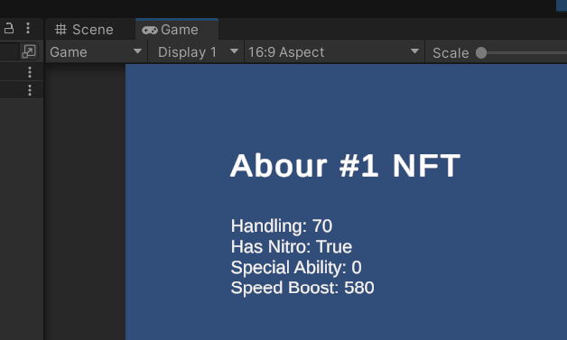
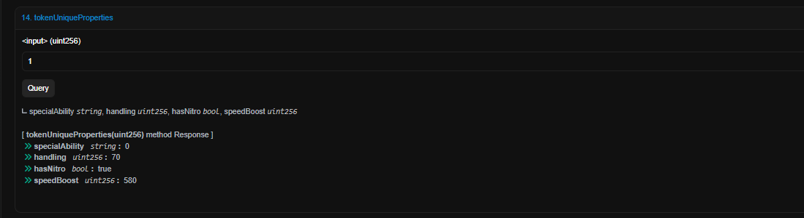

# lab 04

__Виклики функцій користувацьких контрактів, які приймають або повертають складні структури даних__

1. **Модифіковано контракт ERC721**


```js
// SPDX-License-Identifier: MIT
pragma solidity ^0.8.20;

import "@openzeppelin/contracts/token/ERC721/ERC721.sol";
import "@openzeppelin/contracts/access/Ownable.sol";
import "@openzeppelin/contracts/utils/Counters.sol";
import "@openzeppelin/contracts/token/ERC20/IERC20.sol";

contract MatizCarNFT is ERC721, Ownable {
    using Counters for Counters.Counter;
    Counters.Counter private _tokenIds;

    address public tokenAddress; 
    string public baseURI; 

    struct UniqueProperties {
        string specialAbility;
        uint256 handling;
        bool hasNitro; 
        uint256 speedBoost;
    }

    mapping(uint256 => UniqueProperties) public tokenUniqueProperties;
    mapping(uint256 => uint256) public tokenPrices; 

    constructor(address _tokenAddress, string memory _baseURI, address _initialOwner) ERC721("MatizCar", "MTZC") Ownable(_initialOwner) {
        tokenAddress = _tokenAddress;
        baseURI = _baseURI;
    }

    function tokenURI(uint256 _tokenId) public view override returns (string memory) {
        require(_exists(_tokenId), "ERC721Metadata: URI query for nonexistent token");
        return baseURI;
    }

    function setBaseURI(string memory _newBaseURI) external onlyOwner {
        baseURI = _newBaseURI;
    }

    function mintNFT(address recipient, uint256 price, string memory _specialAbility, uint256 _handling, bool _hasNitro, uint256 _speedBoost) external onlyOwner returns (uint256) {
        _tokenIds.increment();
        uint256 newNFTId = _tokenIds.current();
        _mint(recipient, newNFTId);
        tokenPrices[newNFTId] = price;
        tokenUniqueProperties[newNFTId] = UniqueProperties(_specialAbility, _handling, _hasNitro, _speedBoost);
        return newNFTId;
    }


    function buyNFT(uint256 tokenId) external {
        require(tokenPrices[tokenId] > 0, "This NFT is not for sale.");
        uint256 price = tokenPrices[tokenId];
        require(IERC20(tokenAddress).transferFrom(msg.sender, owner(), price), "Token transfer failed.");
        _transfer(ownerOf(tokenId), msg.sender, tokenId);
        delete tokenPrices[tokenId];
        delete tokenUniqueProperties[tokenId];
    }

    function getUniqueProperties(uint256 tokenId) external view returns (UniqueProperties memory) {
        require(_exists(tokenId), "Token does not exist");
        return tokenUniqueProperties[tokenId];
    }

    function _exists(uint256 tokenId) internal view returns (bool) {
        return _ownerOf(tokenId) != address(0);
    }
}


```


2. **Згенеровано C# сервіси для контракту**



3. **Вивід на сцену характеристик авто #1**



Вивід з скану 



*Код проекту*

``` C#
using System;
using System.Threading.Tasks;
using ChainSafe.Gaming.UnityPackage;
using Lab05.Contracts.MatizCarNFT;
using Lab05.Contracts.MatizCarNFT.ContractDefinition;
using TMPro;
using UnityEngine;
using UnityEngine.UI;
using System.Numerics;
using Nethereum.Model;
using Serilog;

public class Instans : MonoBehaviour
{
    [SerializeField] private string MatizCarAddr;
    private MatizCarNFTService matizService;
    public TMP_Text tmpText;

    async void Start()
    {
        ChainSafe.Gaming.Web3.Web3 chainSafeWeb3 = Web3Accessor.Web3;
        Nethereum.Web3.Web3 nethereumWeb3 = new Nethereum.Web3.Web3(chainSafeWeb3.ChainConfig.Rpc);

        matizService = new MatizCarNFTService(nethereumWeb3, MatizCarAddr);
        TokenUniquePropertiesOutputDTO aboutMatiz = await matizService.TokenUniquePropertiesQueryAsync(1);

        tmpText.text = $"Handling: {aboutMatiz.Handling}\n" +
                       $"Has Nitro: {aboutMatiz.HasNitro}\n" +
                       $"Special Ability: {aboutMatiz.SpecialAbility}\n" +
                       $"Speed Boost: {aboutMatiz.SpeedBoost}";

        Debug.Log(await chainSafeWeb3.Signer.GetAddress());
    }

 
}

```