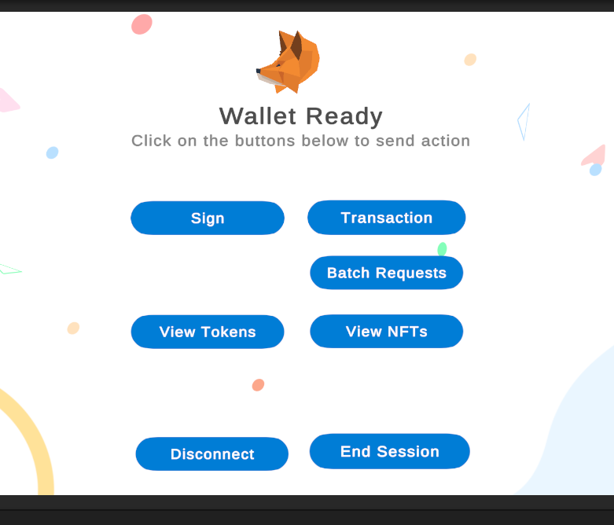

# lab 06

__MetaMask SDK для правильної інтеграції з Metamask__

1. **Додано metamask до проекту**


2. **Ознайомився із прикладами та скриптами всередині Metamask директорії:**



3. **Реалізовано вхід логін**


4. **Виклики з та без параметрів функцій**


```c#
// з параметром
public async void ShowBalance()
        {
            var balance = "0x0..0";
            MetaMaskEthereumRequest newRequest = new MetaMaskEthereumRequest {
                Method = "eth_getBalance",
                Parameters = new string[] {
                    balance,
                    "latest"
                }
            };

            var result = await MetaMaskUnity.Instance.Wallet.Request(newRequest);

            Debug.Log(result);
        }

    // без 
    public async void ReadBlockchainData()
        {
            MetaMaskEthereumRequest request = new MetaMaskEthereumRequest
            {
                Method = "eth_blockNumber",
                Parameters = new string[0]
            };

            var result = await MetaMaskUnity.Instance.Wallet.Request(request);
            Debug.Log(result);
        }
```

5.  **Зроблено підпис та перевірено**

```c#
        public async void PersonalSign () {
            var metaMask = MetaMaskUnity.Instance.Wallet;
            
            var batch = metaMask.BatchRequests();
    
            string from = metaMask.SelectedAddress;
            List<Task<string>> requests = new List<Task<string>>();
            var paramsArray = new string[] { Encoding.UTF8.GetBytes($"Borusov Illia KN-921V").ToHex(), from };
            requests.Add(batch.Request<string>("personal_sign", paramsArray));

            await batch.Send();

            Debug.Log(requests);

        }

```

